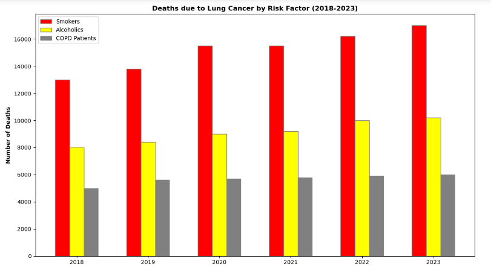

# Project9-EDA-Deaths-Yearly-Due-To-Lung-Cancer
> **Brief Description:** - Deaths due to Lung Cancer by Risk Factors of Smoking, Aloholism and being a COPD patient (2018-2023).

---

## Table of Contents

- [Description](#description)
- [Video Explanation](#video)
- [Technologies Used](#technologies-used)
- [Dataset](#dataset)
- [Program Codes ](#program-codes)
- [Screenshots](#screenshots)
- [Contribution](#contributipn)
- [Contact Details](#contact-details)

---

## Description

Cases of heart failure cases in Kolkata compared for Smokers and Alcoholics during different months of the year. The plotting in this case has been done as comparable line chart with different colors.

## Video

## Technologies-used

Python programming language, pandas, folium, IPython and geopandas package.

## Dataset

The dataset has been generated by another program. However, it is recommended that for real life analysis actual data should be collected and processed properly to get realistic results.

## Program-codes

The programs are written on jupiter notebook, You may run the program on Google colab by clicking on the colab badge below. However, the output may not be generated on colab. For that you have to download the program and run it locally. Make sure that the packages are all installed.

## Screenshots

## Contribution

The programs are written by Santanu Karmakar

## Contact-details

If you wish to contact me, please leave a message (Preferably WhatsApp) on this number: 6291 894 897.
Please also mention why you are contacting me. Include your name and necessary details.
Thank you for taking an interest.
